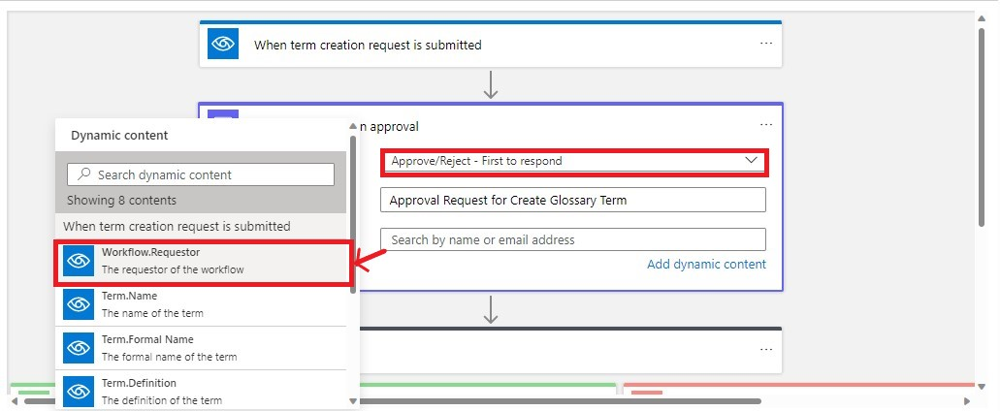
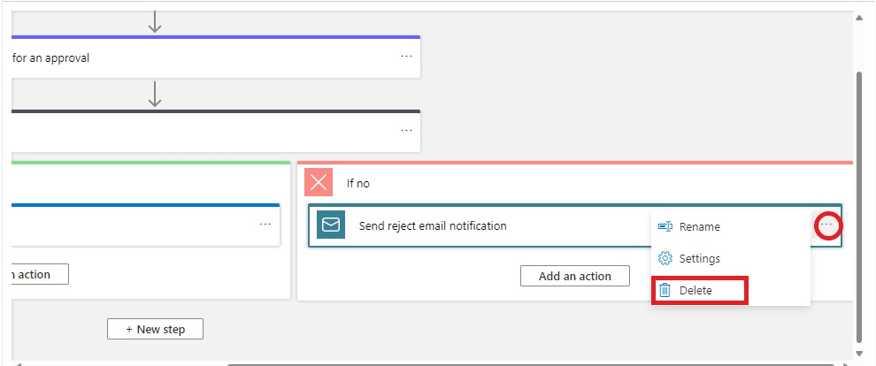
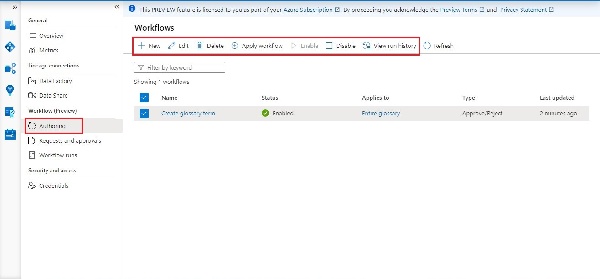

# Approval workflow for Business Terms 

## Introduction

Workflows are automated, repeatable business processes that users can create within Microsoft Purview to validate and orchestrate CUD (create, update, delete) operations on their data entities. Enabling these processes allows organizations to track changes, enforce policy compliance, and ensure quality data across their data landscape.

Workflows are made up of connectors that contain a common set of pre-established actions and are run when specified operations occur in your data catalog. Workflow actions include things like generating approval requests or sending a notification, that allow users to automate validation and notification systems across their organization.

_For example:_ A user attempts to delete a business glossary term that is bound to a workflow. When the user submits this operation, the workflow runs through its actions instead of, or before, the original delete operation.

## Objectives
This step will take you through the creation and management of approval workflows for business terms.

## Pre-Requisites
- An Azure account with an active subscription
- An Azure Microsoft Purview account
- _Workflow administrator_, _Data Source Administrator_ and _Data Reader_ access in the Purview Account

## Steps:

### A. Create Glossary term

1. Sign into the **Purview** governance portal and select the **Management** center. 
2. To create new workflows, select **Authoring** in the **Workflow** section.
3. To create a new workflow, select **+New** button.

  	
4. To create Approval workflows for business terms select **Data Catalog** and select **Continue**.

  	
5. In the next screen, you'll see all the templates provided by Microsoft Purview to create a workflow.

  	The four different templates available for business glossary are:
  	- Create glossary term - when a term is created, approval will be requested.
  	- Update glossary term - when a term is updated, approval will be requested.
  	- Delete glossary term - when a term is deleted, approval will be requested.
  	- Import terms - when terms are imported, approval will be requested.

    Here, let’s select **Create glossary term** using workflow.

  	
6. Next, enter a **workflow name** as **`Create glossary term`** and optionally add a description. Then select **Continue**.

  	
7. You'll now be presented with a canvas where the selected template is loaded by default.

  	

   The default template has the following steps:
   - **_Trigger_** when a glossary term is created/updated/deleted/imported depending on the template selected.
   - **_Approval connector_** that specifies a user or group that will be contacted to approve the request.
   - **_Condition_** to check approval status
	  * If approved:
		  1. Create/update/delete/import the glossary term
		  2. Send an email to requestor that their request is approved, and term CUD (create, update, delete) operation is successful.

	  * If rejected:
		  Send email to requestor that their request is denied.
8. We shall proceed altering the default template by populating the **Start and Wait for approval Connector** with the following.

   Field | Definition
   --- | ---
   **Approval Type** | ``Approve/Reject- First to Respond``
   **Assigned to** | ``Add Dynamic Content -> Workflow.Requestor``
   
  	

   Approval Types:
   - First to Respond: This implies that the first approver’s outcome (Approve/Reject) is considered final.
   - Everyone must approve: This implies everyone identified as an approver must approve the request for the request to be considered approved. If one approver rejects  the request, regardless of other approvers, the request is rejected.

9. In the **If Yes** connector below, select the three dots icon in the **Send email notification** and click **Delete**. 

	
	
	

10. In the **If No** connector below, select the three dots icon in the **Send reject email notification** and click **Delete**. 

	
	
	

9. You can also modify the template by **adding more connectors** to suit your organizational needs. Add a new step to the end of the template by selecting the **New step** button. Add steps between any already existing steps by selecting the **arrow icon** between any steps.

11. Once you're done defining a workflow, you need to bind the workflow to a glossary hierarchy path. The binding implies that this workflow is triggered only for CUD operations within the specified glossary hierarchy path. You need to select **Apply workflow**. **Select the scopes** you want this workflow to be associated with and select **OK**.

	

	
	
11. Finally select **Save and close** to create and the workflow.

	
	
12. Now, go to **Data Catalog** > **Glossary** > Create **+New** term

	
	
13. Select the **system default template**.

	
	
14. Define the name as `Data Analytics` and acronym as `DA` to the term. You can see that the status of the term is in `Draft`. Once you Submit for Approval. If approved, the status will be changed to Approved. If not, will be changed to Rejected.

	
	
15. Go to **Data Management** > **Requests & Approvals** > Select the Pending Approval Request

	
	
16. You can find the Requestor name and details of the request. Respond `Approve` . You can add optional comments.

	

17. Go to **Glossary** under **Data Catalog**. **Refresh** the page. And you will see the newly created term.

	

    
```diff
!	Likewise, we can create workflows for updating, deleting and importing terms too.
```


### B. Workflow Runs

1. To view workflow runs you triggered, go to Workflow Runs section under Workflow in Data Management Center. You'll be presented with the list of workflow runs and their statuses. Select a workflow name to see the details of the workflow run.

2. This will present a window that shows all the actions that are completed, actions that are in-progress, and the next action for that workflow run.

	

### C. History of Workflow requests

All the completed approvals and tasks are moved to this tab in Requests and Approvals section.


### D. Workflow options



- **Edit an existing workflow:** To modify an existing workflow, select the workflow and then select Edit in the top menu. You'll then be presented with the canvas containing workflow definition. Modify the workflow and select Save to commit changes.
- **Disable a workflow:** To disable a workflow, select the workflow and then select Disable in the top menu. You can also disable the workflow by selecting Edit and changing the enable toggle in workflow canvas.
- **Apply Workflow:** To change the scope of the workflow, you can select the workflow and click Apply Workflow to change the scope.
- **View run history:** To see the run history only for a particular workflow. Select a Workflow and click Run History in the top menu.
- **Delete a workflow:** To delete a workflow, select the workflow and then select Delete in the top menu.


[ ⏮️ Previous Module](../02_maintaining-glossary-by-creating-and-importing-terms/documentation.md) - [Next Module ⏭️](../04_create-classification-rule-and-scan-rule-set/documentation.md)

