# Exploring Data Lineage by Connecting Azure Data Factory

Lineage in Purview is visually represented as a graph to show data moving from source to destination. 
It offers Visual representation of source(s), Transformations, and Target(s) showing the data lifecycle. 
Lineage in Purview helps you analyze impact of changes to data and understand dependencies. 
Data lineage is used for different backward-looking scenarios such as troubleshooting root cause analysis of data pipelines or debugging.

Purview can capture lineage for data in different parts of your organization's data estate, and at different levels of preparation including:

-	Completely raw data staged from various platforms
-	Transformed and prepared data
-	Data used by visualization platforms.

In this demo, we will see how to build a Lineage Graph using lineage metadata collected by Azure Data Factory. 

## Prerequisites

1.	An *Azure account* with an active *subscription*.
2.	A Microsoft Purview account
3.	An Azure Data Lake Storage Gen2 Account, Azure Data Factory Account 
4.	**Collection admin** role on the root collection.

## Objectives

1.	Create an **Azure Data Factory Connection** in Purview
2.	**Copy Data** using Azure Data Factory 
3.	**View Lineage** in Azure Purview

## Create an Azure Data Factory Connection in Microsoft Purview

1. Open the **Microsoft Purview Governance Portal**, navigate to **Management** > **Data Factory** under *Lineage connections* and click **New**.

    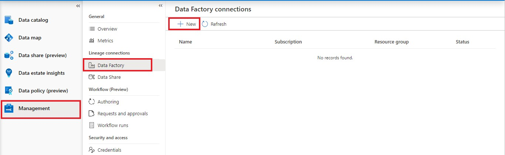

2. Select your Azure Subscription and Azure Data Factory account instance from the drop-down menu *(e.g. `pvlab-{randomId}-adf`)* and click **OK**.

    > Microsoft Purview can connect to **multiple** Azure Data Factories but each Azure Data Factory account can only connect to **one** Microsoft Purview account.

    

3. Once finished, you should see the Data Factory in a **connected** state.

    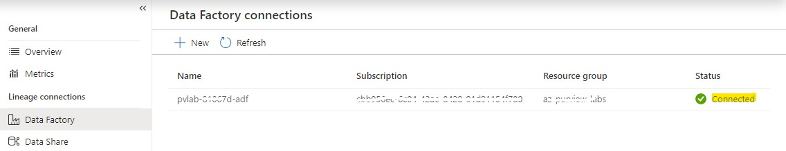

4. To confirm that Azure Data Factory has been provided the necessary access, navigate to **Data map** > **Collections** > `YOUR_ROOT_COLLECTION` > **Role assignments**, within **Data curators** you should be able to see the Azure Data Factory managed identity.

    > When a user creates an Azure Data Factory connection, behind the scenes the Data Factory managed identity is added to the `Data Curator` role. This provides Azure Data Factory the necessary access to push lineage to Microsoft Purview during a pipeline execution.

    

## Copy Data using Azure Data Factory

> In this step, we're going to perform the **_Merged Copy activity_** on all the 2020 .tsv files of BingCoronavirusQuerySet Folder and save it as a one single *parquet* file in the raw container.

1. Within the Azure Portal, navigate to your Azure Data Factory resource, ``pvlab-{randomid}-adf`` and click **Open Azure Data Factory Studio**.

    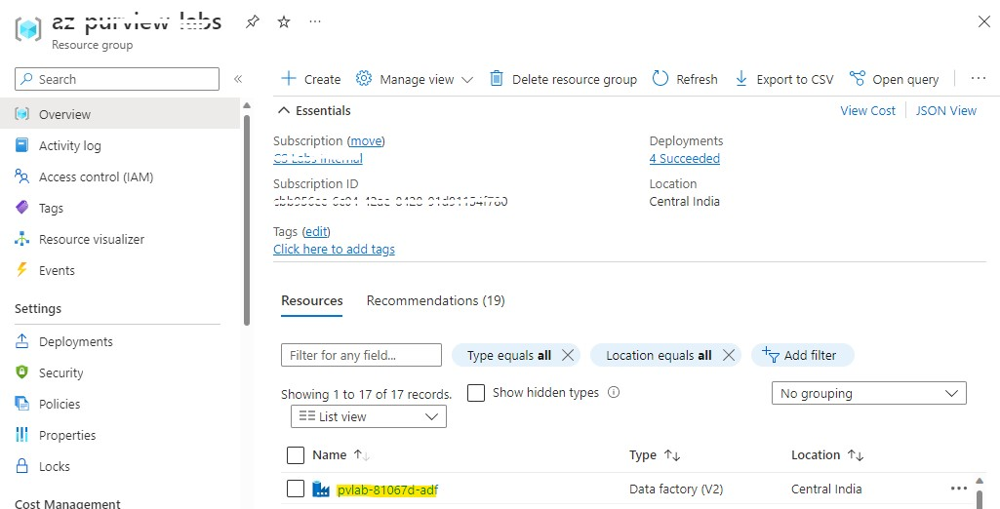

    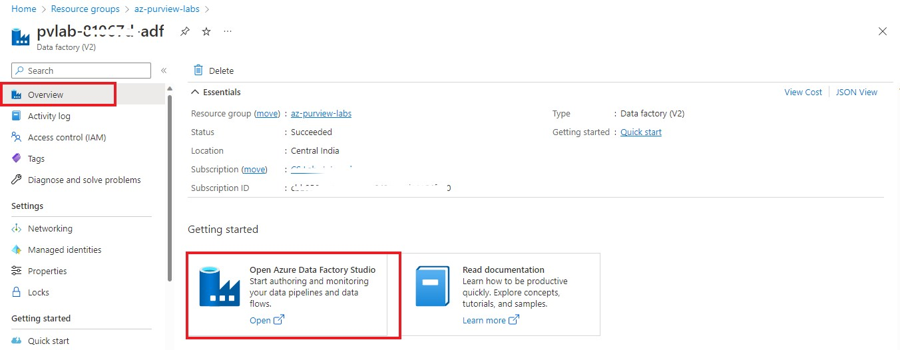

2. Click **Ingest**.
    
    

3. Select **Built-in copy task** and then click **Next**.

    

4. Change the **Source type** to `Azure Data Lake Storage Gen2` and then click **New connection**.

    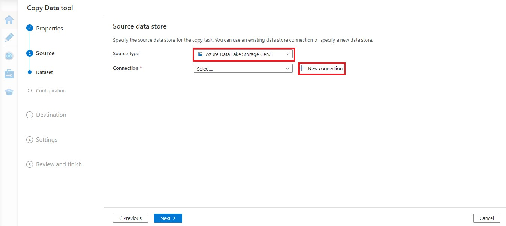

5. Select your **Azure subscription** and **Storage account** (e.g. `pvlab{randomId}adls`), click **Test connection** and then click **Create**.

    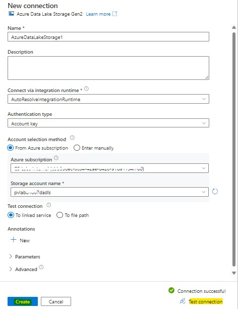

6. Click **Browse**.

    

7. Navigate to `raw/BingCoronavirusQuerySet/2020/` and click **OK**.

    

8. Confirm your folder path selection and click **Next**.

    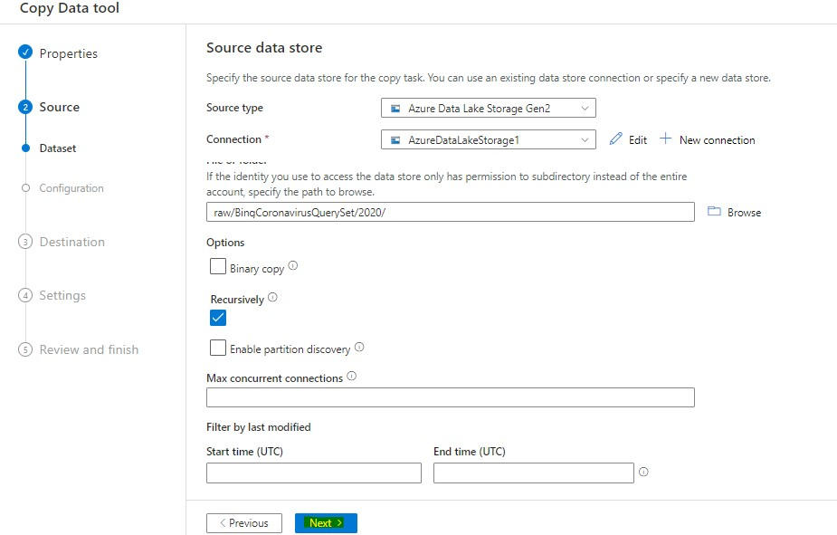

9. Preview the sample data by clicking **Preview data**, and then click **Next**.

    

10. Change the **Target type** to `Azure Data Lake Storage Gen2`, set the **Connection** to the existing connection (e.g. `AzureDataLakeStorage1`), and then click **Browse**.

    

11. Navigate to `raw/` and click **OK**.

    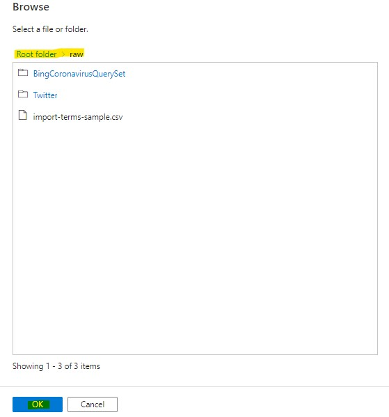

12. Confirm your folder path selection, set the **file name** to `2020_merged.parquet`, set the **copy behavior** to **Merge files**, and click **Next**.

    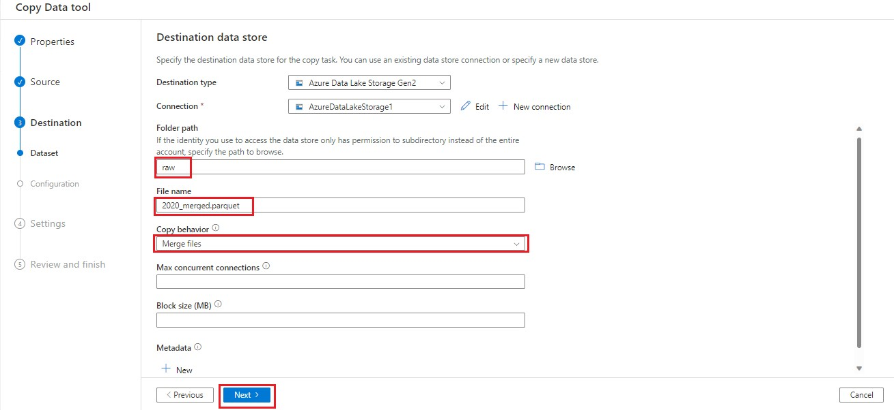

13. Set the **file format** to **Parquet format** and click **Next**.

    

14. Leave the default settings and click **Next**.

    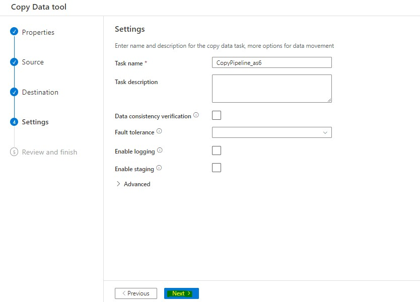

15. Review the summary and proceed by clicking **Next**.

    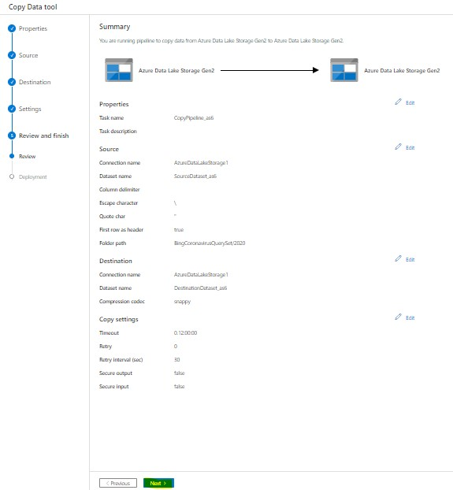

16. Once the deployment is complete, click **Finish**.

    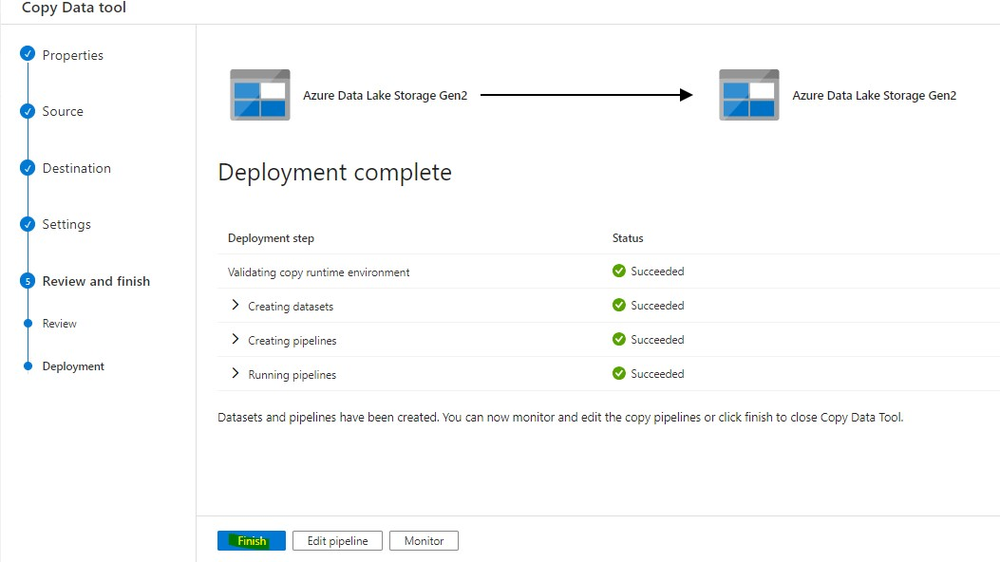

17. Navigate to the **Monitoring** screen to confirm the pipeline has run **successfully**.

    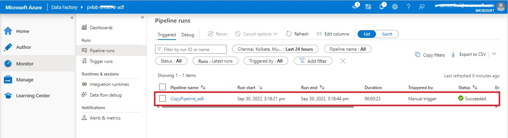

## View Lineage in Microsoft Purview

1. Open the **Microsoft Purview Governance Portal**, from the **Data catalog** screen click **Browse**.

2. Switch to the **By source type** tab and then select **Azure Data Factory**.

    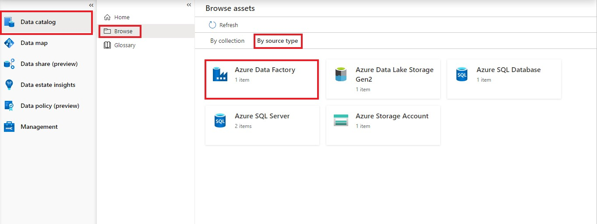

3. Select the **Azure Data Factory account instance** (e.g. `pvlab-{randomId}-adf`).

    

4. Select the **Copy Pipeline** and click to open the **Copy Activity**.

    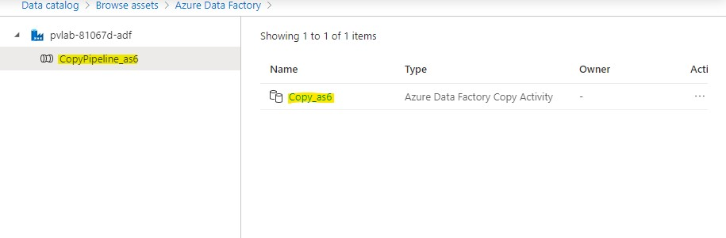

5. Navigate to the **Lineage** tab.

    

6. You can see the lineage information has been automatically pushed from Azure Data Factory to Purview. On the left are the two sets of files that share a common schema in the source folder, the copy activity sits in the center, and the output file sits on the right.

    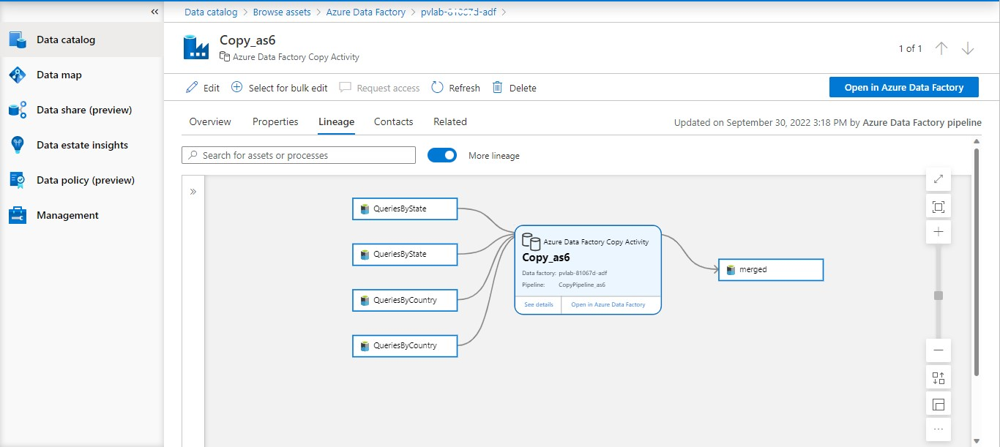
    
    Lineage in Purview Graph shows details for datasets and processes. 
    
      - **_Dataset_**: A dataset (structured or unstructured) provided as an input to a process. 
        _For example_, a SQL Table, Azure blob, and files (such as .csv and .xml), are all considered datasets. In the lineage section of Purview, datasets are represented by rectangular boxes.
      
      - **_Process_**: An activity or transformation performed on a dataset is called a process. 
        _For example_, Azure Data Factory Copy activity or a Data Share snapshot. In the lineage section of Purview, processes are represented by round-edged boxes.

[ ⏮️ Previous Module](../04_create-classification-rule-and-scan-rule-set/documentation.md) - [Next Module ⏭️](../06_view-data-insights/documentation.md)
